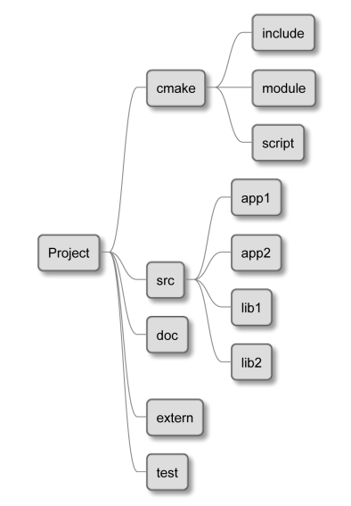
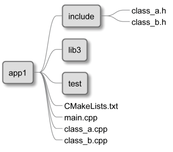
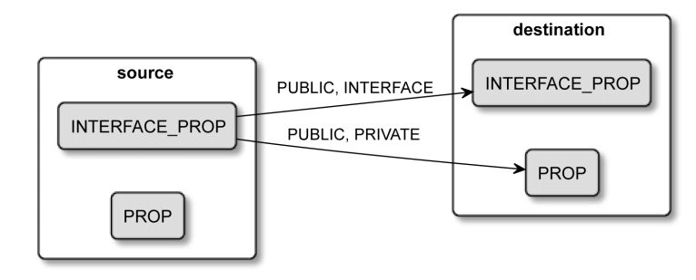
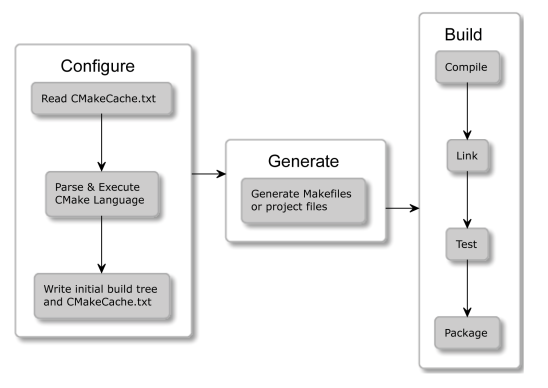

# Modern CMake

## Written on Feb 11 2024

> While reading Modern CMake for C++
>
> [Buy](https://www.packtpub.com/product/modern-cmake-for-c/9781801070058)

### Ignore files in Git
- A template for a good `.gitignore` to skip files from Git is as below.
    ```sh
    # If you put build tree in the source tree add it like so:
    build_debug/
    build_release/
    # Generated and user files
    **/CMakeCache.txt
    **/CMakeUserPresets.json
    **/CTestTestfile.cmake
    **/CPackConfig.cmake
    **/cmake_install.cmake
    **/install_manifest.txt
    **/compile_commands.json
    ```
### CMake language commands
- CMake provides commands which can be grouped into three categories:
    1. **Scripting commands**, are always available and change the state
     of the processor, access variables, etc.
    2. **Project commands**, are available in projects and manipulate the
     project state and build targets.
    3. **CTest commands**, are available in CTest scripts and manage testing.
- `set(...)` command accepts a plain text variable name as its first argument,
 but `message(...)` command uses a variable reference wrapped in the `${}`
 syntax.

### Example project structure
- A good project structure must be easy to navigate, be self-contained and,
 abstraction hierarchy should be expressed through executables and binaries.

- A recommended project structure is shown below.
    
    - `cmake`: includes macros and functions, find_modules and one-off
     scripts.
    - `src`: will store the source of our binaries and libraries
    - `doc`: used for building the documentation
    - `extern`: configuration for the external projects we build from
     source.
    - `test`: contains code for automated tests.
- If we are making a single executable or single library, we can use the
 following file tree structure.


### Working with Targets
- Every project that is big enough will force you to introduce some form
 of partitioning.
- A **target** in CMake is the answer to this problem. A target can depend
 on other targets.
- CMake will take care of determining in what order targets have to be
 built and then execute the necessary steps one by one.
- CMake will create a buildsystem and fill it with recipes to compile each
 of the source files and link them together into a single executable.
- We can create a target using one the three commands:
    1. `add_executable(...)`    (to build executables)
    2. `add_library(...)`       (to build libraries)
    3. `add_custom_target(...)` (code-sanitizer, compilation report)
- `target_link_libraries(...)` is intended for use with actual libraries
 and allows you to control property navigation. `add_dependencies(...)`
 is meant to be used only with top-level targets to set their build order.
- We can create a dependency graph in `dot/graphviz` format using CMake.
 It supports both internal and external dependencies.
    ```bash
    $ cmake --graphviz=test.dot .
    ```
 The above command produces a text file which we can import to Graphviz
 visualization software to render an image or produce PDF/SVG file.

### Transitive usage requirements
- We can this as *propagated properties* between the *source target*
 (targets that get used) and *destination targets* (targets that use
 other targets).
    ```cmake
    target_compile_definitions(<source> <INTERFACE|PUBLIC|PRIVATE>
                    [items1 ...])
    ```
- The propagation keywords are:
    1. `PRIVATE`, sets the property of the source target.
    2. `INTERFACE`, sets the property of the destination targets.
    3. `PUBLIC`, sets the property of the source and destination
     targets.
- When a property is not to be transitioned to any destination targets,
 set it to `PRIVATE`. When such a transition is needed, choose `PUBLIC`.
- In a situation where the source target doesn't use the property in
 its implementation (`.cpp` files) and only in the headers, and these
 are passed to consumer targets, `INTERFACE` is the choice.
    

### Interface libraries
- Library doesn't compile a target but simply serves as a utility target.
- Interface libraries are used to represent **header only libraries**
 and/or bundle a set of properties into a single unit.
- Header only libraries are fairly easy to create (shown below).
    ```cmake
    add_library(Eigen INTERFACE
        src/eigen.h src/vector.h src/matrix.h
    )
    target_include_directories(Eigen INTERFACE
        $<BUILD_INTERFACE:${CMAKE_CURRENT_SOURCE_DIR}/src>
        $<INSTALL_INTERFACE:include/Eigen>
    )
    ```
 In the above code snippet, we create an Egen interface library with three headers.
 We set its *include directories* to be `${CMAKE_CURRENT_SOURCE_DIR}/src` when a
 target is exported and `include/Eigen` when it is installed.
- To use such a library, we simply have to link against it. No actual linking occurs,
 but CMake will understand this command as a request to propagate all the `INTERFACE`
 properties to `executable` target.
    ```cmake
    target_link_libraries(executable Eigen)
    ```
- We could also use the above mechanism to create a logical target that can be a
 placeholder for propagated properties. We can then use this target as a
 dependency for other targets. This helps set properties in a clean, convenient
 way.
    ```cmake
    add_library(warning_props INTERFACE)
    target_compile_options(warning_props INTERFACE
                -Wall -Wextra -Wpedantic
    )
    target_link_libraries(executable warning_props)
    ```
 We use the `warning_props` target to set *compile options* on the `executable`
 target. Using these `INTERFACE` targets improves the readability and reusability
 of your code. Using the `_props` suffix to easily differentiate interface libraries
 from the regular ones.


## Written on Feb 02 2024

> While reading Modern CMake for C++
>
> [Buy](https://www.packtpub.com/product/modern-cmake-for-c/9781801070058)

### Mastering the CMake executable's CLI
- Syntax of the _buildsystem_ generation.
    ```bash
    $ cmake -B ./build -S ./project # source tree in `project`
    ```
    > The `-S` is optional. Not providing `-B` will result in a
    > messy in-source build.
- Selecting and configuring which build tool to use for building
 is handled by CMake. It can by overriden as below.
    ```bash
    $ cmake -G <generator-name> <path-to-source>
    ```
- The `CMAKE_BUILD_TYPE` variable can take values: `Debug`,
 `Release`, `MinSizeRel` or `RelWithDebInfo`. This would generate
 a build tree specific to the build type. Default is `Debug`.
- There are multiple levels to filter the log outputs - `ERROR`,
 `WARNING`, `NOTICE`, `STATUS`, `VERBOSE`, `DEBUG` or `TRACE`. By
 default it is set to `STATUS`.
- Instead of running `make` after generation of build tree to build
 the project, it is recommended to do the following instead.
    ```bash
    $ cmake --build <dir>   # bare minimum
    $ cmake --build <dir> -j [<number-of-jobs>] # for parallel builds
    $ cmake --build <dir> -t clean  # remove build artifacts with `clean` target
    $ cmake --build <dir> --clean-first # clean first and then build
    $ cmake --build <dir> -v    # to obtain more detailed logs
    ```
- Once a project is built, users can install it on their system, _i.e._,
 copy files to correct directories, install libraries, etc.
    ```bash
    $ cmake --install <dir> # bare minimum
    $ cmake --install <dir> --component <comp>  # install only one component
    ```

### CMakeLists.txt
- CMake projects are configured with `CMakeLists.txt` files.
- Need to provide at least one in the root of source tree directory.
- This file is the first to get executed in the configuration stage and
 should contain at least two commands.
    ```cmake
    cmake_minimum_required(VERSION <x.xx>)  # min expected version
    project(<name>)   # project name gets stored to $PROJECT_NAME
    ```
- For bigger projects, heirarchichal `CMakeLists.txt` allow for granular
 configuration (via `add_subdirectory`).

### Config-files for packages
- External packages which support CMake generally provide a configuration
 file so that CMake understands how to use them.
- Use `find_package(...)` command to include packages into your project.
- CMake files describing packages are named `<PackageName>-config.cmake`
 and `<PackageName>Config.cmake`.
- You can specify which version of package you need and CMake will check
 it in the associated `<Config>Version.cmake` file.
- Do not manually edit these files - `cmake_install.cmake`,
 `CTestTestfile.cmake`, `CPackConfig.cmake` files.

### CMakePresets.json and CMakeUserPresets.json
- When building more than type of build tree for a given project, we can
 leverage presets.
- Presets are stored in JSON format in two files:
    1. `CMakePresets.json`, meant for project authors to provide official
     presets.
    2. `CMakeUserPresets.json`, meant for customizing the project configuration
     to your liking.
- Presets are only useful after completion of initial setup.

### CMake scripts
- Instead of writing bash scripts, CMake allows for writing platform-agonistic
 programming language scripts. You can execute scripts as follows.
    ```bash
    $ cmake -P script.cmake
    ```
- A script can be very complex or an empty file. It is recommended to call the
 `cmake_minimum_required(...)` at the beginning of the script.
    ```cmake
    # Example script
    cmake_minimum_required(VERSION 3.20.0)
    message("Hello world")
    file(WRITE Hello.txt "I am writing to a file")
    ```
- While executing scripts, the other stages such as configuration are not run
 and the cache is not used.


## Written on Jan 30 2024

> While reading Modern CMake for C++
>
> [Buy](https://www.packtpub.com/product/modern-cmake-for-c/9781801070058)


### What are the requirements for the script?
- Automate building process to go through project tree and compiles everything.
- Avoid redundant compilations, _i.e._, check whether the source has been modified
 since the last time we ran it.
- Easily manage compiler arguments for each file.
- Build whole solutions that can be resued in bigger projects.

### What are the different aspects of building C++ software?
- Compiling executables and libraries
- Managing dependencies
- Testing
- Installing
- Packaging
- Producing documentation
- Testing some more :wink:

### Why CMake?
- Supports modern compilers and toolchains.
- Cross-platform - Windows, Linux, macOS.
- Generate project files for popular IDEs.
- Operates on right level of abstraction.
- Philosophy that testing, packaging and installing are inherent part
 of the build process.
- Old features get deprecated, resulting in _lean_ CMake.
- Continuous Integration / Continuous Deployment (CI/CD) can use the
 same CMake configuration.

### How does CMake work?
- At an abstract level - it reads source code and produces binaries.
 However, it relies on other tools to perform the actual compilation,
 linking and other tasks.
- It is the _orchestrator_ of the building process: knows what steps
 need to done, what the end goal is, and how to find the right tools
 and materials for the job.



- There are three stages:
    1. **Configuration**
        - Read project details stored in _source tree_ directory and
         and prepare _build tree_ directory for the generation stage.
        - Start with emtpy build tree, collect details about the working
         environment - architecture, available compilers, linkers, etc.
        - `CMakeLists.txt` file is parsed and executed. This file is the
         bare minimum of a CMake project. Tells CMake about project
         structure, its targets and its dependencies.
        - CMake stores collected information in the build tree which
         is used for the next step.
        - `CMakeCache.txt` is created to store more variables (path
         to compilers and other tools) and save time during the next
         configuration.
    2. **Generation**
        - After the above step, CMake will generate a **buildsystem**
         for the exact working environment it is working in.
        - _Buildsystems_ are simply cut-to-size configuration files
         for other build tools (Makefiles for GNU Make _or_ Ninja).
        - The generation stage is executed automatically after the
         configuration stage. To explicitly run only the configuration
         stage, you can use the `cmake-gui` utility.
    3. **Building**
        - In this stage, we run the appropriate _build tool_.
        - The build tool will execute steps to produce **targets** with
         compilers, linkers, static and dynamic analysis tools, test
         frameworks, etc.
- CMake is able to produce buildsystems on demand for every platform
 with a single configuration, _i.e._, same project files.

> Commands to build a very simple application:
>
    > cmake -B build
    >
    > cmake --build build
>

Corresponding `CMakeLists.txt`:
```cmake
cmake_minimum_required(VERSION 3.20)
project(hello)
add_executable(hello hello.cpp)
```

- The above example, generates a buildsystem that is stored in the
 `build` directory, executes the build stage and produces a final
 binary that you can run.
